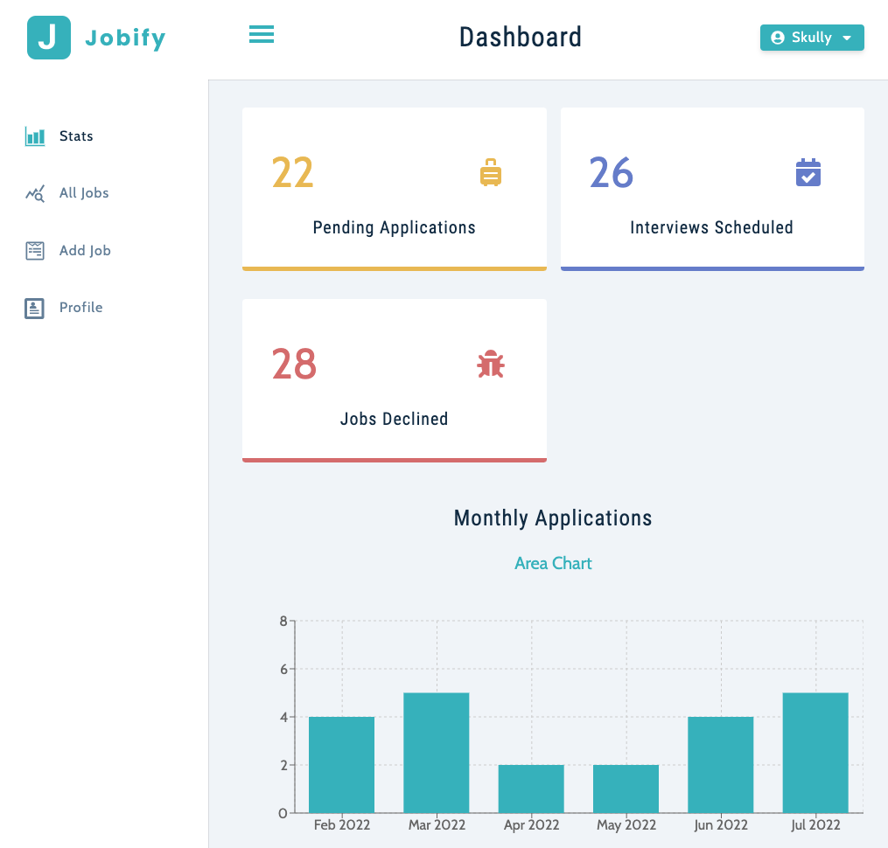

# Jobify-Redux

Boost your job search and find the career of your dreams. Jobify organizes all of your job opportunities in one place and allows you to keep track of application process of each job. This application modified my Jobify repository to use Redux-toolkit instead of context API.

## Getting Started

* Ensure you have Node.js installed.
* Create a free [Mongo Atlas](https://www.mongodb.com/atlas/database) database online or start a local MongoDB database.
* Create a `server/.env` file. Within the `.env` file:
  * Create a `MONGO_URL` property and set it to your MongoDB connection string.
  * Create a unqine JWT token and add to `JWT_SECRET` property.
  * Decide on your desired JWT lifetime and set that to `JWT_LIFETIME` property.
* In the main terminal, run: `npm install && npm run build-client`

## Running the Project

* Make sure you are in the top level directory. In the terminal, run: `npm run prod`
* Begin your job search by going to [localhost:5000](http://localhost:5000)
